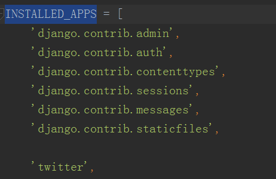
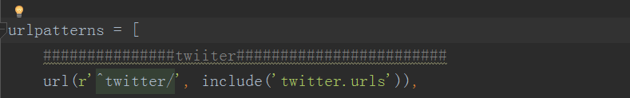
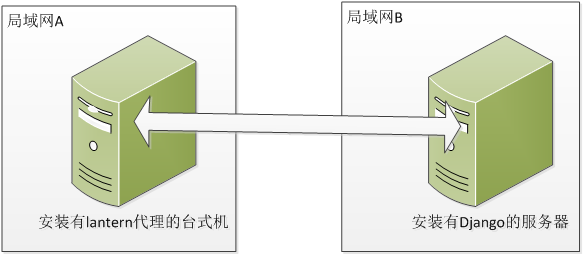

#Django中twitter APP安装

##Django中需要修改的点
1、在settings文件下，INSTALLED_APPS变量中增加一个‘twitter’,如图下所示：

2、在urls文件中，urlpatterns变量中增加一行‘url(r'^twitter/', include('twitter.urls')),’，如下图所示：

3、在twitter APP中/TwitterCapture/constants文件修改DEFAULTHOST变量（这是mongodb的地址）

##服务器需要安装的python包
***安装命令为：pip install ...***

psutil, requests, pymongo, selenium, bs4, TwitterAPI, setproctitle, happybase, pykafka, ner
PySocks, win_inet_pton, elasticsearch

***注：setproctitle包不能直接在windows下安装，需要去下面的网址找到相应的安装包：***
[非官方的windows下的python扩展包地址](https://www.lfd.uci.edu/~gohlke/pythonlibs/)
***下载完成后，在命令窗口下输入pip install ...whl***

在Windows下需要修改C:\Python27\lib\site-packages\thriftpy\parser\parser.py文件488行,
 if url_scheme == '': 修改为 if url_scheme in ('c', 'd', 'e', 'f', 'g'):

在服务器Centos下安装psutil时出现“error: command 'gcc' failed with exit status 1”错误，需要安装：yum install gcc libffi-devel python-devel openssl-devel包

***2017/12/1***

登陆MongoClient有两种方式：
1、uri = "mongodb://%s:%s@%s" % (quote_plus('kb314'), quote_plus('fzdwxxcl.314'), '121.49.99.14:30011')

2、client = MongoClient('example.com',user='user',
password='password',authSource='the_database',
authMechanism='SCRAM-SHA-1')***记住必须要MongoClient3.5版本***

[MongoClient的登录方式官方文档](http://api.mongodb.com/python/current/api/pymongo/mongo_client.html)

***2017/12/2***

Question:

1、为什么代理不买服务器自己搭一个？
  1）需要大量的流量；2）购买的固定IP容易被封

2、为什么不直接将lantern部署在服务器上？
  lantern需要图形界面，除非去改源代码，但没这个能力。

3、选择了lantern与VpyrVPN后，如何使用？

  如上图所示，局域网A中有一台开了lantern的台式机，打开代理端口如192.168.1.148:8118，配置局域网A的路由器，将8118端口映射出去，
局域网B中有一台服务器，开启Django时，同时开启一个代理监控线程。A中台式机有一个定时任务，不断向Django发送请求，Django接收到请求后，判断局域网A的IP是否改变，如果改变，重写配置文件。
代理监控线程发现配置文件改变时，会重新加载，这样解决了局域网动态IP的问题。

***2017/12/4***

"AttributeError: 'module' object has no attribute 'lru_cache' "
django2.0不在支持python2.7。所以记得下载pip install Django==1.11.2。
